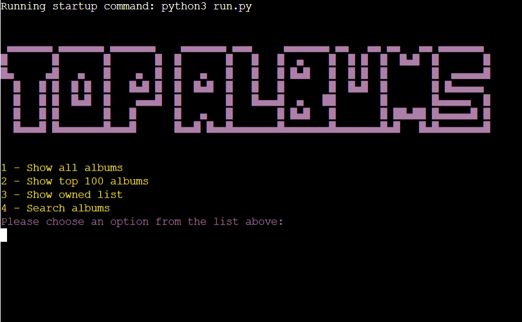

# Top Albums 

Top Albums is a python based terminal application. This application allows users to query a csv file containing The Rolling Stones top 500 albums. Users can obtain a list of all albums, to include their ranking, year, album and artist. Users can query the top 100 albums. They can also add and remove an album to a list of their owned albums. Finally users can search the albums by title, year, artist and genre. This application was designed for any music enthusiast to enjoy. 

A live version of the project can be accessed here: [Top Albums](https://top-500-albums-lmclaughlin-aa0faa062497.herokuapp.com/)



# Table Of Contents

* [User Experience Design](#user-experience-design)
  * [User Demographic](#user-demographic)
  * [User Stories](#user-stories)
* [Flowchart](#flowchart)
* [Imports used](#imports-used)
* [Technologies used ](#technologies-used)
* [Features](#features)
  * [Existing Features](#existing-features)
    * [Menu](#menu)
    * [Search menu](#search-menu)
    * [Owned menu](#owned-menu)
  * [Features Left to Implement](#features-left-to-implement)
* [Testing](#testing)
  * [Menu](#menu-1)
  * [Owned menu](#owned-menu-1)
  * [Search menu](#search-menu-1)
  * [Validator Testing](#validator-testing)
    * [CI Python Linter](#ci-python-linter)
* [known Bugs](#known-bugs)
* [Deployment](#deployment)
* [Credits](#credits)
  * [Content](#content)
  * [Code](#code)
* [Acknowledgements](#acknowledgements)

# User Experience Design

## User Demographic

This application is intended for:

* Users that have a keen interest in music.
* Users that would like to track which albums they own.
* Users that wish to query they top 500 albums according to Rolling Stones.  

## User Stories

As a User of this application:

* I want to view the rankings of the top albums.
* I want to track which albums I own from the list.
* I want to be able to search the albums.

# Flowchart


[Back to top](#top-albums)

# Imports Used 

*  [Tabulate](https://pypi.org/project/tabulate/) was used to format all the tables in this application. Both grid and plain tables where used. 
* [Termcolor](https://pypi.org/project/termcolor/) was used to add colour into this application. 
* [CSV](https://pypi.org/project/csv342/) was used to aid with reading the CSV file. 

# Technologies used 

* <b>Python</b> - This application was developed using Python.  
* <b>Heroku</b> - Used for deployment.
* <b>GitHub</b> - The code for this application is stored on GitHub.
* <b>Git</b> - Used for version control.  
* <b>Codeanywhere</b> - IDE used for creating the application.
* <b>Lucid chart</b> - Used to create the flowchart.  

# Features

The top albums python terminal application contains three main menus. Each menu and its functionality will be described in detail below. The three main menus in this design are:

* Main menu.  
* Search menu. 
* Owned menu.

## Existing Features

### Menu 

* The main menu is the point to run the application.
* It contains options to show all albums, show the top 100 albums, view the owned list and search albums, in which the user is directed to the search menu. 
* The user can navigate this menu by choosing an option from 1 - 4.


* If the user chooses option 1 from this menu they will be directed to a list of all albums, to include their ranking, year, album and artist. 
* The owned menu will be displayed after the list of albums.


* If the user selection is option 2 the top 100 albums depending on ranking will be displayed. 
* The owned menu will be displayed after the list of albums. 


* Option 3 will bring the user to a list of their owned albums.
* If the user has not entered any albums into this list a message displayed in red will be shown to the user to inform them of this. 
* Either after the list of owned albums or the message is displayed to the user the owned menu will be shown to the user.


* If the user chooses option 4 they will be directed to the search menu.

### Search menu 

* The search menu contains options for the user to search the albums by title, year, artist and genre.


* If the user chooses option 1, they will be asked to enter a search query relating to the album title. 


* Option 2 allows the user to search by year. The user must enter a year between 1955 and 2011. 


* If the user selects option 3 They will be directed to enter a search query relating to artist. 


* Option 4 directs the user to enter a search query to search by genre.


### Owned menu 

* The owned menu is shown after any album list is generated either by choosing the option or searching.
* In the owned menu users can add an album to the owned list, remove an album from the owned list, return to the main menu or exit the programme which restarts the application. 


* If the user selects option 1 they are asked to input the ranking of the album they would like to add to the owned list.
* The user must input a number between 1 and 500 and the same album cannot be added twice. 


* Option 2 will allow a user to remove an album from the owned list.
* The user must input a number between 1 and 500 and the album ust be present in the owned list. 


* Option 3 and 4 return to the main menu and exit or restart the application respectively. 

## Features Left to Implement

* A system could be implemented that allows users to add to the list of albums. 
* Exporting the owned list to a database could be implemented.
* Allowing the user to log in to the application, so as the application could run many different user profiles would be a future adaptation of this application. 

[Back to top](#top-albums)

# Testing

Testing of the functionality of this python terminal based application can be seen in the following tables. All testing was carried out in the deployed version of this application. 

### Menu

|Feature  | Expect  | Action | Result | 
|--|--|--|--|
| Option 1 | When option 1 is selected the user will be redirected to a list of all albums |Chose option 1 | pass
|Option 2 | When option 2 is selected the user will be redirected to a list of the top 100 albums  |Chose option 2 | pass
|Option 3 |When option 3 is selected the user is redirected to the owned list if this list is empty the user will be informed of this |Chose option 3| pass
|Option 4|When option 4 is selected the user is directed to a search menu |Chose option 4 | pass
| Input incorrect selection (integer) |An error message in red is displayed to the user "Invalid input: Please choose a number between 1 and 4" |Chose 5 as a selection | pass
|Input incorrect selection (string)|An error message in red is displayed to the user "Invalid input: Please choose a number between 1 and 4"|Chose "cat" as a selection | pass
|Input incorrect selection (empty)|An error message in red is displayed to the user "Invalid input: Please choose a number between 1 and 4"|Enter empty input | pass

### Owned menu 

|Feature  | Expect  | Action | Result | 
|--|--|--|--|
| Option 1 | When option 1 is selected the user will be asked to input the ranking of the album they would like to add to the owned list |Chose option 1 | pass
| Input value out of range for option 1 | An error message will appear in red "Invalid input: Please enter a number between 1 and 500" |Input 501 | pass
| Input string for option 1 | An error message will appear in red "Invalid input: Please enter a number between 1 and 500" |Input "cat" | pass
| Input empty value for option 1 | An error message will appear in red "Invalid input: Please enter a number between 1 and 500" |Input empty value | pass
| Input value already in list for option 1 | An error message will appear in red "Album already in list!" |Input value already present in list | pass
|Option 2 | When option 2 is selected the user will be asked to chose the ranking of the album they would like to remove |Chose option 2 | pass
| Input value out of range for option 2 | An error message will appear in red "Invalid input: Please enter a number between 1 and 500" |Input 501 | pass
| Input string for option 2 | An error message will appear in red "Invalid input: Please enter a number between 1 and 500" |Input "cat" | pass
| Input empty value for option 2 | An error message will appear in red "Invalid input: Please enter a number between 1 and 500" |Input empty value | pass
| Input value not in list for option 2 | An error message will appear in red "Album not in owned list!" |Input value not in list | pass
|Option 3 |When option 3 is selected the user is redirected back to the main menu |Chose option 3| pass
|Option 4|When option 4 is selected the user is directed to the opening title including the main menu |Select option 4 | pass
| Input incorrect selection (integer) |An error message in red is displayed to the user "Invalid input: Please choose a number between 1 and 4" |Chose 5 as a selection | pass
|Input incorrect selection (string)|An error message in red is displayed to the user "Invalid input: Please choose a number between 1 and 4"|Chose "cat" as a selection | pass
|Input incorrect selection (empty)|An error message in red is displayed to the user "Invalid input: Please choose a number between 1 and 4"|Enter empty input | pass

### Search menu

|Feature  | Expect  | Action | Result | 
|--|--|--|--|
| Option 1 | When option 1 is selected the user will be asked to input a search query according to the album title |Chose option 1 | pass
| Input string that is not a valid query for option 1 | An error message will appear in red "No albums found, please try again!" |Input "poxa" | pass
| Input empty value for option 1 | An error message will appear in red "Invalid input: Input cannot be empty" |Input empty value | pass
|Option 2 | When option 2 is selected the user will be asked to "Please input a year from 1955 to 2011"|Chose option 2 | pass
| Input value out of range for option 2 | An error message will appear in red "Invalid input: Please try again!" |Input 2012 | pass
| Input string for option 2 | An error message will appear in red "Invalid input: Please try again!" |Input "cat" | pass
| Input empty value for option 2 | An error message will appear in red "Invalid input: Please try again!" |Input empty value | pass
|Option 3 | When option 1 is selected the user will be asked to input a search query according to the album artist |Chose option 3| pass
| Input string that is not a valid query for option 3 | An error message will appear in red "No albums found, please try again!" |Input "poxa" | pass
| Input empty value for option 3 | An error message will appear in red "Invalid input: Input cannot be empty" |Input empty value | pass
|Option 4|When option 4 is selected the user is asked to input a search query relating to genre |Select option 4 | pass
| Input string that is not a valid query for option 4 | An error message will appear in red "No albums found, please try again!" |Input "cat" | pass
| Input empty value for option 4 | An error message will appear in red "Invalid input: Input cannot be empty" |Input empty value | pass
| Input incorrect selection (integer) |An error message in red is displayed to the user "Invalid input: Please choose a number between 1 and 4" |Chose 5 as a selection | pass
|Input incorrect selection (string)|An error message in red is displayed to the user "Invalid input: Please choose a number between 1 and 4"|Chose "cat" as a selection | pass
|Input incorrect selection (empty)|An error message in red is displayed to the user "Invalid input: Please choose a number between 1 and 4"|Enter empty input | pass

## Validator Testing

###  CI Python Linter
The Three python files run.py, search.py and owned.py where passed through the official [CI Python Linter](https://pep8ci.herokuapp.com/#)

There where Two warnings relating to trailing whitespace on lines 179 and 182 in run.py, in which the ASCII art is defined, these whitespaces were not removed as it would change the look of the ASCII art. 


There where no errors present in owned.py.


There where no errors present in search.py.


[Back to top](#top-albums)

# known Bugs

All known bugs have been fixed, below is a list of bugs encountered and how they have been fixed.

|Bug  | Status | Solution  | 
|--|--|--|
|When all albums was chosen to be displayed the full table did not fit in the terminal horizontal scroll| fixed| Changed the table type to plain from grid to allow all albums to be viewed. Grid was kept as the default for all other tables as it is more ascetically pleasing. 
|When adding to the owned list, one album higher was appending. For example if choosing album 45 album 46 would append to the list| fixed| Resolved by querying the album ranking index in the list - 1.
|The table using tabulate was too large for the screen and therefore distorted| fixed| Resolved by using ```maxcolwidths``` a built in function with tabulate that lets you specify the width of the table columns.
|Circular import error when trying to import run.py into owned.py and search.py| fixed |Resolved by removing the import for run.py and calling the desired functions within run.py instead|
|When reading in the CSV file, it would break when certain characters where reached in the file | fixed |Resolved by setting the encoding for the CSV file to latin1|
|In order to exit the application from the owned menu, I imported sys and tried to use ```sys.exit()```, however this would not work when deployed to Heroku| fixed |I decided that when the user wants to exit the application they would be redirected to the opening screen and the main menu.|
|When deploying to Heroku, imports such as tabulate and term colour where not recognised| fixed |I needed to update my requirements.txt file to include these imports.|

# Deployment 

1. Create a list of requirements that the project needs to run.  Heroku must install the dependencies used in the project. To do this type the command ```pip3 freeze > requirements.txt``` in the terminal to update the requirements.txt file.
2. Navigate to heroku.com and either log in or sign up using the form provided. 
3. Click create app from your Heroku dashboard.
4. Give the app a unique name.
5. Navigate to the settings tab.
6. Add a Config Var with a key of ```PORT``` and value of ```8000```.
7. Add Buildpacks first python and then node.js.
8. Navigate to the deploy tab.
9. Select GitHub as the deployment method.
10. Search for GitHub repository, click connect to link up the GitHub repository to our Heroku app.
11. You can choose to either automatic deploy or manually deploy the app.
12. Automatic deploy will build the app each time it is pushed to GitHub. To enable this choose the branch you would like to deploy and click ```Enable Automatic Deploys```. 
13. To manually deploy the app click ```Deploy Branch```.
14. To view the deployed app click ```Open app``` at the top of the page.

A live version of the project can be accessed here: [Top Albums](https://top-500-albums-lmclaughlin-aa0faa062497.herokuapp.com/)

# Credits

### Content

* [CSV file](https://github.com/Currie32/500-Greatest-Albums/blob/master/albumlist.csv) 

### Code

* [Assistance with reading in a CSV file](https://realpython.com/python-csv/)
* [Tabulate](https://pypi.org/project/tabulate/)
* [ASCII art](https://texteditor.com/ascii-art/)
* [Checking if a list is empty](https://stackoverflow.com/questions/53513/how-do-i-check-if-a-list-is-empty)
* [Removing an item from a list](https://datagy.io/python-list-pop-remove-del-clear/)
* [Use of PASS keyword](https://www.w3schools.com/python/ref_keyword_pass.asp)
* [Removing item from owned list](https://www.pythonforbeginners.com/basics/list-of-lists-in-python)
* [Termcolor](https://pypi.org/project/termcolor/)

# Acknowledgements

I would like to thank my mentor Lauren-Nicole Popich, the Code Institute team and the Slack community.  

[Back to top](#top-albums)