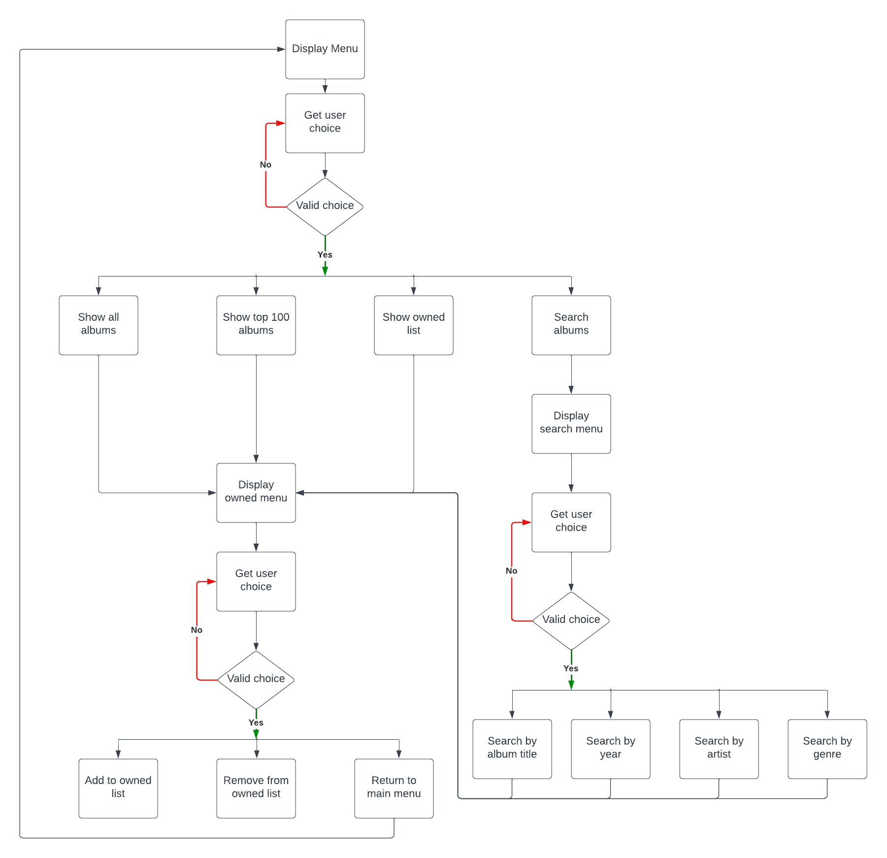

# Flowchart

# Testing

Testing of the functionality of this python terminal based application can be seen in the following tables. All testing was carried out in the deployed version of this application. 

### Menu

|Feature  | Expect  | Action | Result | 
|--|--|--|--|
| Option 1 | When option 1 is selected the user will be redirected to a list of all albums |Chose option 1 | pass
|Option 2 | When option 2 is selected the user will be redirected to a list of the top 100 albums  |Chose option 2 | pass
|Option 3 |When option 3 is selected the user is redirected to the owned list if this list is empty the user will be informed of this |Chose option 3| pass
|Option 4|When option 4 is selected the user is directed to a search menu |Chose option 4 | pass
| Input incorrect selection (integer) |An error message in red is displayed to the user "Invalid input: Please choose a number between 1 and 4" |Chose 5 as a selection | pass
|Input incorrect selection (string)|An error message in red is displayed to the user "Invalid input: Please choose a number between 1 and 4"|Chose "cat" as a selection | pass
|Input incorrect selection (empty)|An error message in red is displayed to the user "Invalid input: Please choose a number between 1 and 4"|Entered empty input | pass
